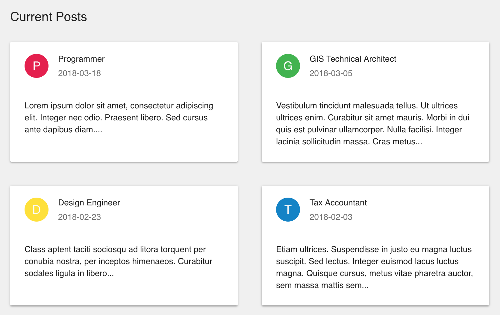

# Rendering a Custom ListView

You can render a list of model data in any way you wish using the `component`
property of the [&lt;ListView /&gt;](/api/rev-ui/interfaces/ilistviewprops.html)
component. The screenshot below shows the posts from the previous example,
rendered as a grid of cards instead of a table.



To create a custom ListView component, you just need to implement a React
component that accepts [IListViewComponentProps](/api/rev-ui/interfaces/ilistviewcomponentprops.html),
as shown in the example below

## JSX for a Custom ListView Component

First, create a React component that accepts
[IListViewComponentProps](/api/rev-ui/interfaces/ilistviewcomponentprops.html)
and renders the data as needed. We recommend creating a Stateless Functional
Component for this, since RevJS handles the loading and data state for you:

```jsx
const MyCustomListView = (props: IListViewComponentProps<models.Post>) => {
    if (props.loadState == 'LOADING') {
        // Loading state
        return (
            <Typography variant="subheading">
                Loading...
            </Typography>
        );
    }
    else {
        // Render the posts as a list of cards
        const postCards = props.results.map((post) => (
            <Card>
                <CardHeader
                    avatar={
                        <Avatar style={{ backgroundColor: getColour() }}>
                            {post.title.substr(0, 1)}
                        </Avatar>
                    }
                    title={post.title}
                    subheader={post.post_date}
                />
                <CardContent>
                    <Typography component="p">
                        {post.body}
                    </Typography>
                </CardContent>
            </Card>
        ));

        return (
            <div>
                <Typography variant="title">
                    {props.title}
                </Typography>
                <Grid container spacing={40}>
                    {postCards}
                </Grid>
            </div>
        );
    }
};
```

To render your custom list component, simply pass it into RevJS's ListView
component along with the query you want to populate it with. There is obviously
no need to pass in the `fields` prop in this case - all the fields of the 
`Post` model will be available for you to render.

```jsx
<ModelProvider modelManager={modelManager} >
    <ListView
        title="Current Posts"
        model="Post"
        where={{
            post_date: { _gt: '2017-01-01' }
        }}
        orderBy={['post_date desc']}
        component={MyCustomListView}
    />
</ModelProvider>
```

*(Complete working example
[here](https://github.com/RevJS/revjs/blob/master/packages/examples/src/creating_a_ui/custom_list/custom_list.tsx)).*
