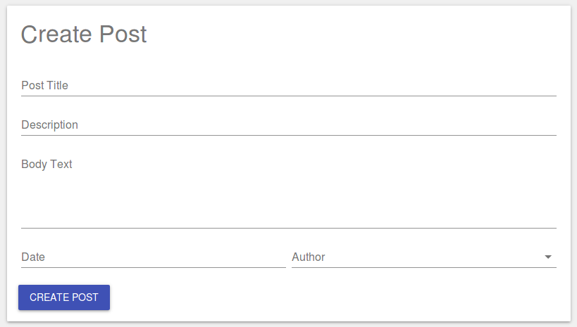
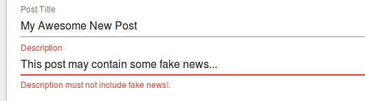

# Creating a DetailView

You can use a [&lt;DetailView /&gt;](/api/rev-ui/interfaces/idetailviewprops.html),
combined with
[&lt;Field /&gt;](/api/rev-ui/interfaces/ifieldprops.html)s and a
[&lt;SaveAction /&gt;](/api/rev-ui/interfaces/isaveactionprops.html)
to quickly build a form to allow users to edit model data.



RevJS uses the metadata you have defined on your models to determine the type
of input to display for each field.

When the Save button is clicked, the data is validated
against the rules you have defined on your model, and any validation problems
are displayed to the user, as shown in the example below:



## JSX for a "Create Post" DetailView

The following JSX code will render the DetailView shown above:

```jsx
<ModelProvider modelManager={modelManager} >

    <Typography variant="display1">Create Post</Typography>

    <DetailView model="Post">
        <Field name="title" colspan={12} />
        <Field name="description" colspan={12} />
        <Field name="body" colspan={12} />
        <Field name="post_date" />
        <Field name="user" />

        <SaveAction label="Create Post" />
    </DetailView>

</ModelProvider>
```

To help with easy field layout, a DetailView defines a 12-column, responsive
grid in which your fields are placed. You can use the `colspan`,
`colspanNarrow` and `colspanWide` properties of the `<field />` component to
specify how wide each field is, depending on the screen size. The default
colspan for fields is 6 on 'normal' and 'wide' screens, and 12 on 'narrow'
screens.

A DetailView acts on a **single model instance**. If you don't specify the
`primaryKeyValue` property for the `<DetailView />` then a new record will
be created when the SaveAction is triggered.

## Editing an existing record in a DetailView

Editing an existing record in a DetailView is simply a case of setting the
`primaryKeyValue` property. In the example below, we grab a post ID from the
URL to allow it to be edited:

```jsx
const currentUrl = new URL(window.location.href);
const postId = currentUrl.searchParams.get('id');

<ModelProvider modelManager={modelManager}>

    <Typography variant="display1">Edit Post</Typography>

    <DetailView model="Post" primaryKeyValue={postId}>
        <Field name="title" colspan={12} />
        <Field name="description" colspan={12} />
        <Field name="body" colspan={12} />
        <Field name="post_date" />
        <Field name="user" />

        <SaveAction label="Save Post" />
    </DetailView>

</ModelProvider>
```

In this case, when the Save button is clicked, the existing record will be
updated.

There is a complete working example that demonstrates the above functionality
[here](https://github.com/RevJS/revjs/blob/master/packages/examples/src/creating_a_ui/detailview/detailview.tsx).
