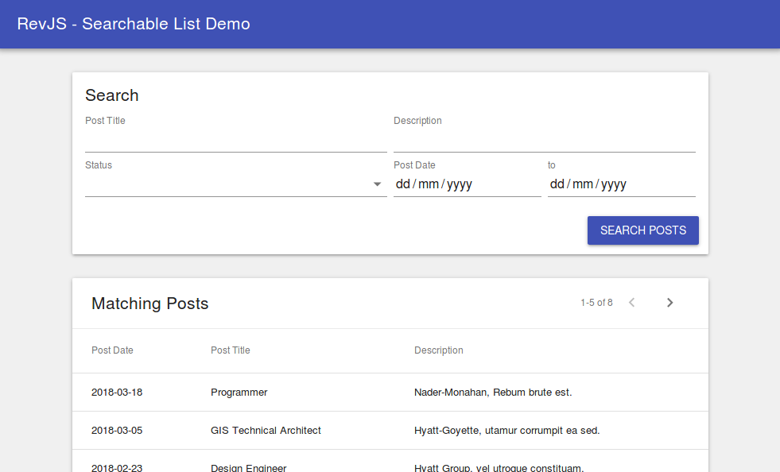

# Building a UI with RevJS

The `rev-ui` module of RevJS provides a number of React components designed to
help you quickly build data-driven user interfaces. We have provided a set of
Material UI components (in the `rev-ui-materialui` module), however `rev-ui`
is designed to be used with **any UI components**, including your own.

When combined with `rev-api-client`, you can render data from your API with
a very minimal amount of front-end code. Check out the
[ListView example](simple_list.md) and the
[DetailView example](detail_view.md).

## RevJS UI Components

RevJS provides the follwing basic components, as building blocks for your data
driven application. The rendering of each of these can be completely customised
via the `component` property of each, or globally via the
[UI_COMPONENTS](/api/rev-ui/index.html#ui_components) configuration setting.

**Views**

* **[&lt;ListView /&gt;](/api/rev-ui/interfaces/ilistviewprops.html)** - Loads and
  renders a list of records, including **filtering**, **sorting** and
  **pagination**.
* **[&lt;SearchView /&gt;](/api/rev-ui/interfaces/isearchviewprops.html)** - Combine
  this with a ListView to allow **user-defined searching**.
* **[&lt;DetailView /&gt;](/api/rev-ui/interfaces/idetailviewprops.html)** - Loads
  a single record, and provides functions for **validating**, **saving**
  and **removing** it.

**Actions**

The following components can be placed inside a `<DetailView />`, to trigger
the corresponding action.

* **[&lt;SaveAction /&gt;](/api/rev-ui/interfaces/isaveactionprops.html)** - Validate
  and save the curremt record.
* **[&lt;RemoveAction /&gt;](/api/rev-ui/interfaces/iremoveactionprops.html)** -
  Remove the current record.
* **[&lt;PostAction /&gt;](/api/rev-ui/interfaces/ipostactionprops.html)** - Validate
  the current record, then send the data as JSON to any HTTP endpoint.

**Fields**

The following components can be placed inside a `<DetailView />`, to allow
the user to edit the model data.

* **[&lt;Field /&gt;](/api/rev-ui/interfaces/ifieldprops.html)** - Displays an
  appropriate input control, depending on the type of the field specified.
  Also displays any field-level validation errors when they occur.

**Provider**

* **[&lt;ModelProvider /&gt;](/api/rev-ui/interfaces/imodelproviderprops.html)** -
  A React Provider that gives its sub-components access to models from the
  specified RevJS ModelManager.

The following sections give some complete examples of how to make use of the
above components.