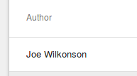

# Rendering Related Model Data

One of the key things about a well structured Data Model is how the models
are related.

In the classic `Post`, `User`, `Comments` model, a User can be
either an author of a Post, or of a Comment. If you need to update a User's
name, ideally you don't want to have to go through all the Posts and Comments
updating the name, instead you should update just the User object, and 
have a "Link" between Posts and Comments, and the User.

In RevJS, this is achieved with `RelatedModel` fields (see
[Working with Related Models](../using_models/related_data.md)).

Once you have these relationships defined, you'll probably want to be able to
display this related information to the user. The following sections
describe a couple of ways this can be done.

## Displaying RelatedModel fields

In the example above, we mentioned that a User can be an Author of a Post.

In our Post model, this is modelled as shown below:

```ts
export class Post {
    @RelatedModel({ label: 'Author', model: 'User' })
        user: User;
    ...
}
```

If we just include the `user` field in our ListView fields, it will
appear as shown in the screenshot below:


You may notice that "[object Object]" is the standard result of calling
`toString()` on a JavaScript object. So, to have the Author name displayed,
we just need to override the `toString()` method on the `User` model:

```ts
export class User {
    ...

    toString() {
        return this.first_name + ' ' + this.last_name;
    }
}
```

This will result in the user's name being shown, which is what we want:



## Using JavaScript Getters

There may be situations where just defining a toString() method on a model is
not flexible enough, for example if you want a User's details to be displayed
differently in different situations, or if the value you want to show is based
on data from multiple models.

In these situations you can a
[JavaScript Getter](https://developer.mozilla.org/en-US/docs/Web/JavaScript/Reference/Functions/get)
function.

In the example below, we define a Getter on our Post object which returns
the number of Comments:

```ts
class Post {
    ...
    @IntegerField({ label: 'No. of Comments' })
        get number_of_comments() {
            return (this.comments && this.comments.length) || 0;
        }
}
```

*(Note: this requires retrieval of all the comments, so don't do this in
production!)*

Once the getter is defined as a field, you can then add `number_of_comments` to
the `fields` list of your ListView, and it will be displayed as shown below:


## Reading Related Models in ListViews

By default, when a [&lt;ListView /&gt;](/api/rev-ui/interfaces/ilistviewprops.html)
fetches data, it will fetch fields from the **specified model only**.

If you wish to fetch related model data, you will need to specify the `related`
property.

In the example below, we retrieve Posts along with their Author and Comments:

```jsx
<ModelProvider modelManager={modelManager} >
    <ListView
        title="Current Posts"
        model="Post"
        fields={[
            'post_date',
            'title',
            'description',
            'user',
            'number_of_comments',
        ]}
        related={[
            'user',
            'comments'
        ]}
        where={{
            post_date: { _gt: '2017-01-01' }
        }}
        orderBy={['post_date desc']}
        limit={5}
    />
</ModelProvider>
```

*(Complete working example
[here](https://github.com/RevJS/revjs/blob/master/packages/examples/src/creating_a_ui/related_data/related_data.tsx)).*
