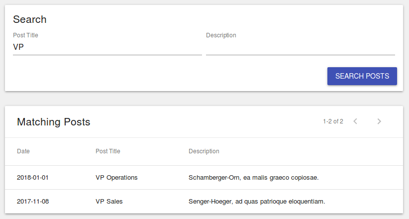

# Creating a Searchable ListView

To create a searchable ListView, you need to create a component that wires up a
[&lt;SearchView /&gt;'s onSearch() Event](/api/rev-ui/interfaces/isearchviewprops.html#onsearch)
to your
[&lt;ListView /&gt;'s &quot;where&quot; prop](/api/rev-ui/interfaces/ilistviewprops.html#where).



## Searchable ListView Example

The following code creates a searchable ListView component:

```tsx
interface ISearchableListState {
    where: object;
}

export class SearchableList extends React.Component<any, ISearchableListState> {

    constructor(props: any) {
        super(props);
        this.state = {
            where: {}
        };
    }

    onSearch(newWhere: object) {
        this.setState({
            where: newWhere
        });
    }

    render() {
        return (
            <div>
                <Card>

                    <Typography variant="title">Search</Typography>

                    <SearchView
                        model="Post"
                        onSearch={(where) => this.onSearch(where)}
                    >
                        <SearchField name="title" />
                        <SearchField name="description" />

                        <SearchAction label="Search Posts" />
                    </SearchView>

                </Card>
                <Card>

                    <ListView
                        title="Matching Posts"
                        model="Post"
                        fields={[
                            'post_date',
                            'title',
                            'description',
                        ]}
                        where={this.state.where}
                    />

                </Card>
            </div>
        );
    }
}
```

In the example above we create a new, stateful, `<SearchableList />` component.
This component's state contains a single item: `where`, which contains the
where clause that is automatically generated by the RevJS `<SearchView />`
component.

When the `<SearchAction />` is triggered by the user, the `onSearch()` event
is fired, which in-turn updates the state of the `<SearchableList />` component.

This then triggers a re-render of the `<SearchableList />` component, which then
passes the updated `where` clause to the `<ListView />`, which triggers it
to re-fetch the matching data.

*(Complete working example
[here](https://github.com/RevJS/revjs/blob/master/packages/examples/src/creating_a_ui/searchable_list/searchable_list.tsx)).*
