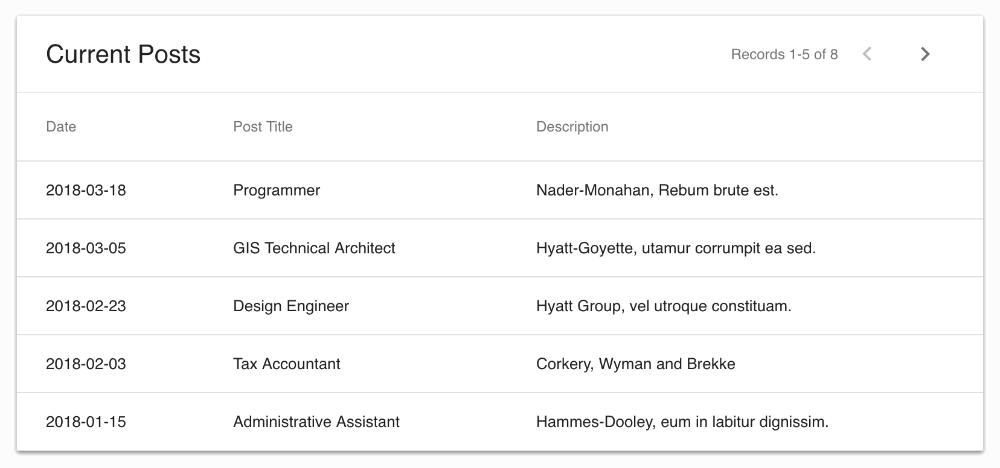

# Rendering a Simple List

By default, a [&lt;ListView /&gt;](/api/rev-ui/interfaces/ilistviewprops.html)
will render a table, as shown in the screenshot below:



The data starts loading as soon as the ListView is rendered. A Loading
indicator is shown until the data has finished loading. Once the data is loaded,
the user can use the forward and back buttons to page through the data.

## JSX for a Simple List

The following JSX code will render the list shown above:

```jsx
<ModelProvider modelManager={modelManager} >
    <ListView
        title="Current Posts"
        model="Post"
        fields={[
            'post_date',
            'title',
            'description',
        ]}
        where={{
            post_date: { _gt: '2017-01-01' }
        }}
        orderBy={['post_date desc']}
        limit={5}
    />
</ModelProvider>
```

*(Complete working example
[here](https://github.com/RevJS/revjs/blob/master/packages/examples/src/creating_a_ui/simple_list/simple_list.tsx)).*

You can use the `fields` prop of the ListView to select which columns to
show, and the `where`, `orderBy` and `limit` props to control the data shown.

In the next example, we'll look at how to render your own list view components.